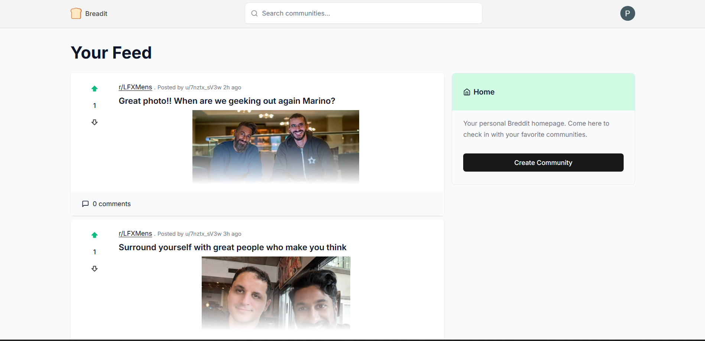
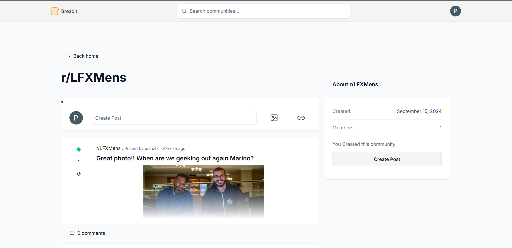
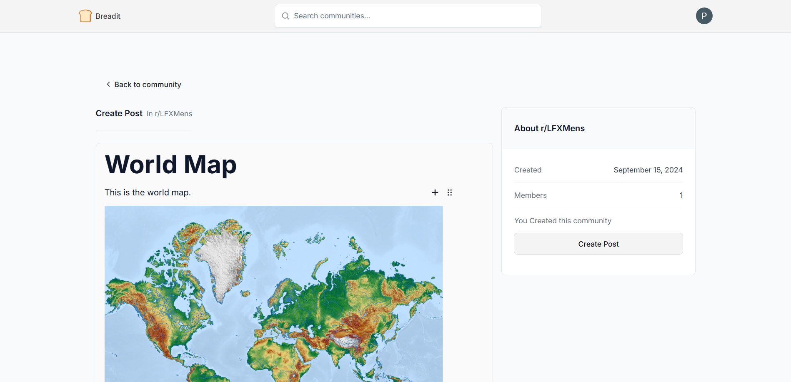
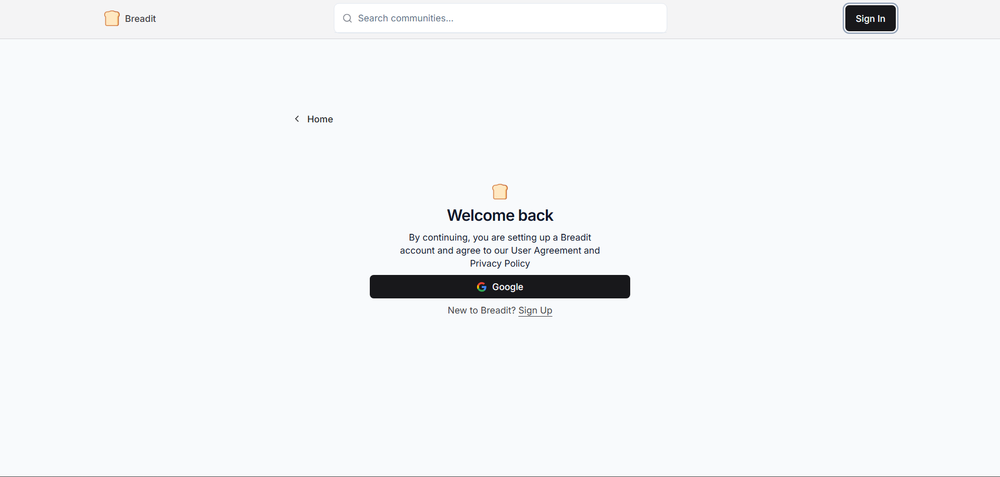

<p align='center'></p>

# 🥖 Breadit - Social News Aggregation Website

**Breadit** is a social news aggregation, content rating, and discussion platform, inspired by Reddit. It allows users to create their own spaces for focused interaction, discussion, and content sharing. With real-time features, community-building tools, and secure authentication, **Breadit** provides a seamless social experience for users.

Explore it live at [Breadit on Vercel](https://breadit-gray.vercel.app).

---

## Screenshots
1. Home Page

<p align='center'></p>
2. Create Community Page

<p align='center'></p>
3. Create Post Page

<p align='center'></p>
4. Sign In Page

<p align='center'></p>


## ✨ Key Features

- **Create & Join Communities**: Users can create unique spaces to interact and discuss with like-minded people.
- **Post Creation & Image Uploads**: Share ideas, stories, and images in communities.
- **Engage with Posts**: Upvote/downvote posts, leave comments, and like/dislike comments for lively discussions.
- **Infinite Scrolling**: Browse through endless content with smooth, infinite scrolling.
- **Search Communities**: Easily find and join new communities based on your interests.
- **Authentication & Security**: Powered by **NextAuth**, offering secure login and data protection.
- **Optimized Performance**: Leveraging **Redis** caching for quick content retrieval and minimal latency.

---

## 🛠 Technology Stack

| Frontend    | Backend      | Database  | Authentication | Caching   | ORM        |
|-------------|--------------|-----------|----------------|-----------|------------|
| Next.js     | Next.js API  | PostgreSQL| NextAuth       | Redis     | Prisma ORM |
| React.js    | TypeScript   | Prisma ORM| JWT Sessions   |           |            |

Additional libraries: 
- **React Query**: Efficient server-state handling and data fetching.
- **Zustand**: Lightweight state management for a smoother user experience.
- **UploadThing**: Simple and fast file uploads for images and other media.

---

## 🚀 Getting Started

To run **Breadit** locally, follow these steps:

### Prerequisites

- Node.js (v20+)
- PostgreSQL (Ensure it's installed and running)
- Redis (for caching)

### Installation

1. **Clone the repository:**

   ```bash
   git clone https://github.com/Prathamm-sahu/Breadit.git
   cd Breadit
   ```

2. **Install dependencies:**

   ```bash
   npm install
   ```

3. **Environment Setup:**

   - Rename `.env.example` to `.env`.
   - Configure your database connection and authentication keys in the `.env` file.

4. **Run the development server:**

   ```bash
   npm run dev
   ```

   Open [http://localhost:3000](http://localhost:3000) in your browser to view the app.

---

## 🗃️ Database Setup

Breadit uses **PostgreSQL** as its primary database and **Prisma ORM** for database schema management and queries. To set up the database:

1. Ensure PostgreSQL is running.
2. Run the following Prisma commands to migrate your database:

   ```bash
   npx prisma migrate dev
   ```

---

## 🔧 Project Structure

```
/components     # UI and Reusable components (buttons, forms, etc.)
/app          # Application pages (Next.js routing)
/lib            # Utility libraries for API and state management
/prisma         # Database schema and Prisma ORM configurations
/public         # Static assets (images, fonts, etc.)
/styles         # Global CSS and styling
```

---

## 🎯 Contributing

We welcome contributions! Feel free to fork the repo and submit pull requests. For major changes, please open an issue first to discuss what you'd like to improve.

---

## 🔒 Security

Authentication is managed via **NextAuth** for secure login, registration, and data protection. Sessions are secured with JSON Web Tokens (JWT).

---

## 🌐 Demo

Check out the live demo hosted on Vercel: [Breadit Live](https://breadit-gray.vercel.app)

---

## 📄 License

This project is open-source and available under the [MIT License](https://opensource.org/licenses/MIT).